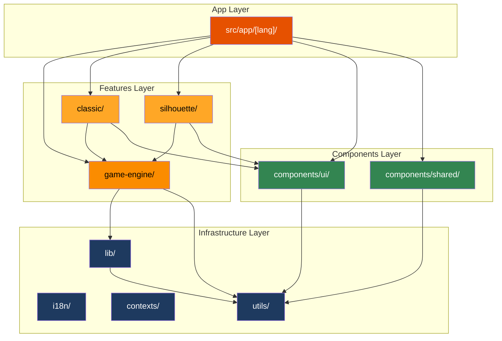
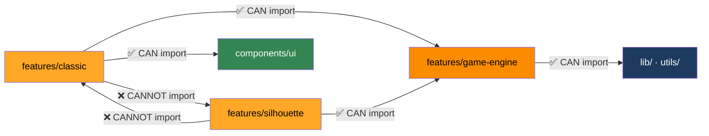
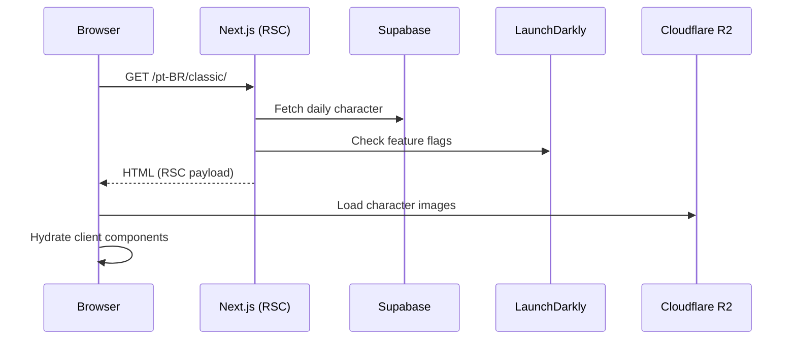

# 🏗️ Architecture

DragonBallDle follows **Feature-Sliced Design (FSD)**, a methodology for organizing frontend applications into isolated, self-contained layers with strict dependency rules. See [ADR-001](./decisions/001-fsd-architecture.md) for the rationale.

## Layer Diagram



## Folder Structure

```text
src/
├── app/[lang]/            # Next.js pages with dynamic locale routing
│   ├── classic/           # Classic game mode page
│   ├── silhouette/        # Silhouette game mode page
│   ├── contact-us/        # Contact form page
│   ├── legal/             # Legal/privacy page
│   ├── layout.tsx         # Root layout (fonts, providers, analytics)
│   └── page.tsx           # Home page (mode selector)
│
├── features/              # Domain-driven feature modules
│   ├── game-engine/       # Shared core game logic
│   │   ├── contexts/      # GameContext, GuessesContext
│   │   ├── hooks/         # useGameFlow, useGuesses, useCharacterCache, etc.
│   │   ├── services/      # API calls (characters, daily, wins, leaderboard)
│   │   ├── types/         # CharacterGuess, GuessStatus, GameMode
│   │   └── utils/         # Game-specific utilities
│   ├── classic/           # Classic mode UI components
│   │   └── components/
│   └── silhouette/        # Silhouette mode UI components
│       └── components/
│
├── components/            # Presentation layer (business-agnostic)
│   ├── ui/                # Atoms: Header, Footer, Modal, Tooltip, Countdown, etc.
│   ├── shared/            # Game-related reusable: WinModal, GuessesTable, WinsBadge
│   ├── desktop/           # Desktop-specific layout components
│   ├── mobile/            # Mobile-specific components (BottomNavBar)
│   └── providers/         # Client-side context providers
│
├── i18n/                  # Internationalization layer
│   ├── navigation.ts      # Wrapped Link/redirect (MUST use this, never next/link)
│   ├── routing.ts         # Locale definitions (20 languages)
│   └── request.ts         # Server-side locale resolution
│
├── contexts/              # Global React contexts
├── lib/                   # Infrastructure & configuration
│   ├── daily.ts           # Timezone-aware date logic (todayBrasiliaKey)
│   ├── feature-flags.ts   # LaunchDarkly integration
│   ├── supabase/          # Supabase client configuration
│   └── db/                # Database query utilities
│
├── utils/                 # Pure utility functions
│   ├── cn.ts              # clsx + tailwind-merge
│   ├── seed.ts            # Deterministic PRNG for daily characters
│   ├── storage.ts         # LocalStorage wrapper
│   └── time.ts            # Time formatting utilities
│
├── shared/                # Cross-cutting shared types
├── types/                 # Global TypeScript types
└── hooks/                 # Global custom hooks
```

## Dependency Rules

These rules **must** be followed to maintain architectural integrity:



| Rule | Description |
|---|---|
| Features are isolated | `classic/` and `silhouette/` **never** import from each other |
| `game-engine` is the hub | Shared hooks, types, and services live here |
| Components are agnostic | `components/ui/` should not contain game logic |
| Unidirectional flow | Lower layers never import from upper layers |

## Server vs Client Components

Next.js 16 defaults to **Server Components**. The project follows this principle:

| Pattern | When |
|---|---|
| Server Component (default) | Static content, data fetching, metadata |
| `"use client"` | Hooks (`useState`, `useEffect`), event handlers, browser APIs, animations |

**Translation pattern for client components:**

```
Server (layout.tsx)               Client Component
┌───────────────────┐            ┌──────────────────────┐
│ getTranslations() │──bundle──→ │ <TranslationProvider> │
│ or                │            │   useTranslations()   │
│ getTranslationsBundle()│       └──────────────────────┘
└───────────────────┘
```

## Request Lifecycle



## Related Docs

- [Game Engine](./game-engine.md) — deep dive into hooks, services, and types
- [ADR-001: FSD Architecture](./decisions/001-fsd-architecture.md) — rationale
