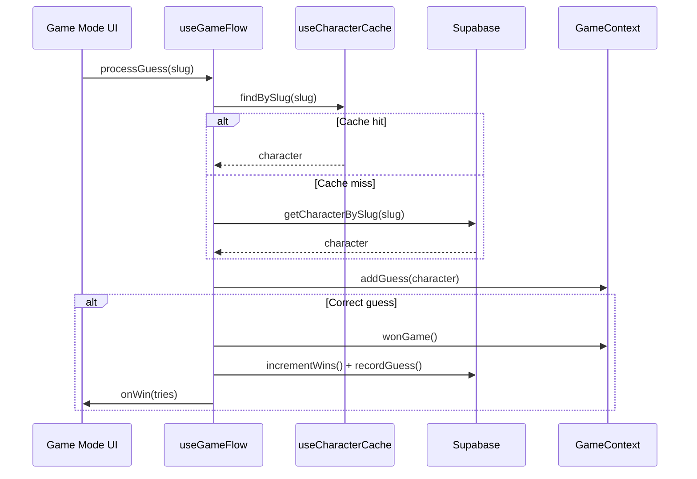
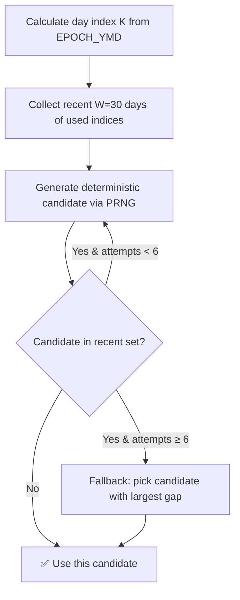

# 🎮 Game Engine

The game engine is the core domain module located in `src/features/game-engine/`. It contains all shared logic, hooks, services, and types used by both Classic and Silhouette game modes.

## Module Structure

```text
features/game-engine/
├── contexts/          # GameContext, GuessesContext
├── hooks/
│   ├── useGameFlow.ts          # Orchestrates guess → win flow
│   ├── useGuesses.ts           # Manages guess state
│   ├── useCharacterCache.ts    # IndexedDB character cache (Dexie)
│   ├── useCharacterSearch.ts   # Search/autocomplete for character input
│   └── useWinsRealtime.ts      # Realtime win count subscription
├── services/
│   ├── characters.ts           # Character CRUD from Supabase
│   ├── daily.ts                # Fetch daily challenge data
│   ├── wins.ts                 # Win tracking (increment/read)
│   └── leaderboard.ts          # Leaderboard entries
├── types/
│   ├── character.ts            # Base character type
│   ├── game-mode.ts            # GameMode enum
│   ├── guess.ts                # GuessStatus, CharacterGuess, comparison functions
│   └── silhouette.ts           # Silhouette-specific types
└── utils/                      # Game-specific pure functions
```

## useGameFlow Hook

The central orchestrator for any game mode. It handles the full guess-to-win pipeline:

```typescript
const { processGuess, handleWin } = useGameFlow({
  gameMode: GameMode,
  dailyCharacterSlug: string,
  onWin?: (tries: number) => void,
  winDelay?: number,        // ms before triggering win (for animations)
  checkWinOnGuess?: boolean, // auto-check on guess (false for deferred win)
});
```

### Flow



### Classic Mode
- `checkWinOnGuess: true` — win is detected immediately on correct guess
- `winDelay: 800` — delay for the row animation before showing the win modal

### Silhouette Mode
- `checkWinOnGuess: false` — win is deferred until after the silhouette reveal animation
- Uses `handleWin(tries)` manually after the animation completes

## Daily Character Algorithm

Located in `src/lib/daily.ts`. The algorithm ensures no character repeats within a sliding window.

### Constants

| Constant | Value | Description |
|---|---|---|
| `EPOCH_YMD` | `2025-01-01` | Day zero for index calculation |
| `WINDOW_DAYS` | `30` | Anti-repeat sliding window size |
| `MAX_ATTEMPTS` | `6` | Retries before fallback to best-gap selection |

### How It Works



### Timezone Awareness

> [!CAUTION]
> **Never** use `new Date()` or manual `toISOString()` for the daily key. Always use `todayBrasiliaKey()`.

The game operates on **Brasilia time (UTC-3)**. `todayBrasiliaKey()` uses `Intl.DateTimeFormat` with `America/Sao_Paulo` timezone to generate the `YYYY-MM-DD` key, ensuring all users worldwide see the same puzzle at the same time (relative to midnight in São Paulo).

```typescript
// ✅ Correct
import { todayBrasiliaKey } from "@/lib/daily";
const today = todayBrasiliaKey(); // "2026-04-28"

// ❌ Wrong — timezone-dependent, will vary by user location
const today = new Date().toISOString().slice(0, 10);
```

## Type System

### GameMode

```typescript
type GameMode = "classic" | "silhouette";
```

### GuessStatus

```typescript
enum GuessStatus {
  CORRECT,    // Exact match
  PARTIAL,    // Some overlap (e.g., shared race)
  WRONG,      // No match
  OLDEST,     // Guessed saga is after the target
  NEWEST,     // Guessed saga is before the target
  MOVIE_MISMATCH, // Target is from a movie, guess is not
}
```

### Character Types

| Type | Used by | Key fields |
|---|---|---|
| `CharacterGuess` | Both modes | `slug`, `name`, `gender`, `races`, `series`, `debut_saga`, `affiliations`, `attributes`, `has_transformations` |
| `ClassicCharacter` | Classic | Extends with `image_path` |
| `SilhouetteCharacter` | Silhouette | Extends with `silhouette_path`, `silhouette_colored_path` |
| `YesterdayCharacter` | Both | Minimal: `slug`, `name`, `thumb_path` |

### Comparison Functions

| Function | Compares | Returns |
|---|---|---|
| `compareValue(guessed, daily)` | Comma-separated slugs | `CORRECT`, `PARTIAL`, or `WRONG` |
| `compareSaga(guessed, daily)` | Saga objects with `sort_order` | `CORRECT`, `NEWEST`, `OLDEST`, or `MOVIE_MISMATCH` |
| `compareTransformation(guessed, daily)` | Boolean values | `CORRECT` or `WRONG` |

## Character Cache

The `useCharacterCache` hook uses **Dexie** (IndexedDB wrapper) to cache characters locally. This avoids redundant API calls when users search for previously fetched characters and provides instant autocomplete.

## Related Docs

- [Architecture](./architecture.md) — where game-engine fits in the FSD structure
- [Infrastructure](./infrastructure.md) — Supabase setup for the backend
