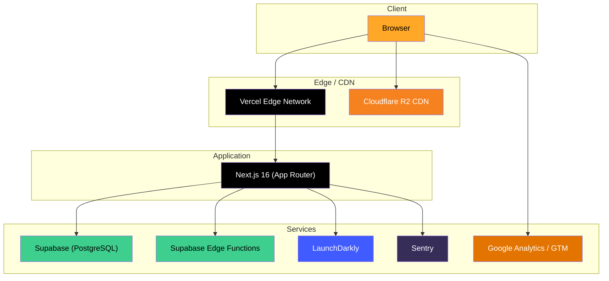

# ⚙️ Infrastructure

Overview of all external services, integrations, and deployment configuration powering DragonBallDle.

## Architecture Overview



## Supabase

**Role:** Primary database (PostgreSQL) and serverless functions.

### Configuration

| File | Purpose |
|---|---|
| `src/lib/supabase/` | Client configuration (browser and server) |
| `src/lib/db/` | Database query utilities |
| `supabase/migrations/` | SQL migration files |
| `supabase/functions/` | Edge Functions (Deno runtime) |
| `supabase/seed.sql` | Seed data for local development |

### Environment Variables

| Variable | Scope | Description |
|---|---|---|
| `NEXT_PUBLIC_SUPABASE_URL` | Client + Server | Supabase project URL |
| `NEXT_PUBLIC_SUPABASE_PUBLISHABLE_DEFAULT_KEY` | Client + Server | Anon/public key |
| `SUPABASE_SERVICE_ROLE_KEY` | Server only | Admin key for scripts |

### Local Development

For running a local Supabase instance, see [Local Supabase Setup](./LOCAL_SUPABASE.md).

### Deployment

Supabase migrations are deployed via GitHub Actions (`.github/workflows/supabase-deploy.yml`).

---

## Feature Flags (LaunchDarkly)

**Role:** Controlled feature rollout.

### Configuration

Located in `src/lib/feature-flags.ts`. Uses the Node.js Server SDK with polling mode (no streaming, for serverless compatibility).

### Available Flags

| Flag Key | Type | Description |
|---|---|---|
| `show-silhouette` | `boolean` | Enables/disables the Silhouette game mode |

### Usage

```typescript
import { getFeatureFlag, ANONYMOUS_CONTEXT } from "@/lib/feature-flags";

const showSilhouette = await getFeatureFlag(
  "show-silhouette",
  ANONYMOUS_CONTEXT,
  false // default if LaunchDarkly is unavailable
);
```

### Graceful Degradation

If `LD_SDK_KEY` is not set or is `"your-ld-sdk-key"`, the SDK returns `null` and all flags fall back to their default values. This means the app works without LaunchDarkly in local development.

---

## Sentry

**Role:** Error monitoring and performance tracking.

### Configuration

| File | Purpose |
|---|---|
| `sentry.server.config.ts` | Server-side Sentry initialization |
| `sentry.edge.config.ts` | Edge runtime Sentry initialization |
| `src/instrumentation.ts` | Server instrumentation entry point |
| `src/instrumentation-client.ts` | Client instrumentation entry point |
| `src/app/global-error.tsx` | Global error boundary with Sentry capture |

### Features

- **Tunnel route** (`/api/sentry-tunnel`) — routes browser requests through the server to circumvent ad-blockers
- **Source maps** — uploaded during CI builds for readable stack traces
- **Tree-shaking** — debug logging is automatically removed in production
- **Vercel Cron Monitors** — automatic instrumentation enabled

---

## CDN (Cloudflare R2)

**Role:** Optimized delivery of character images and static assets.

### Configuration

| Variable | Value |
|---|---|
| `NEXT_PUBLIC_CDN_BASE_URL` | `https://cdn.dragonballdle.site` |

### Image Pipeline

```
Cloudflare R2 (origin) → CDN Edge → next/image (optimization) → Browser
```

Images are served via `next/image` with the CDN as the remote pattern:

```typescript
// next.config.ts
images: {
  remotePatterns: [
    { protocol: "https", hostname: "cdn.dragonballdle.site" },
    { protocol: "https", hostname: "pub-7a42112fb83543e09f959229a0efd07f.r2.dev" },
  ],
}
```

---

## Analytics

### Google Analytics

Integrated via `@next/third-parties/google`:

```typescript
<GoogleAnalytics gaId={process.env.NEXT_PUBLIC_GA_ID!} />
```

### Google Tag Manager

```typescript
<GoogleTagManager gtmId={process.env.NEXT_PUBLIC_GTM_ID!} />
```

> [!IMPORTANT]
> **Never remove `id` attributes** from HTML elements — they may be coupled to analytics events or A/B testing scripts.

---

## Deployment

### Vercel

The application is deployed to [Vercel](https://vercel.com/) with automatic deployments on push to `main`.

### CI/CD Pipeline

Two GitHub Actions workflows:

| Workflow | Trigger | Jobs |
|---|---|---|
| `ci.yml` | Push to `main`, PRs | Lint, Unit, Integration, E2E tests |
| `supabase-deploy.yml` | Push to `main` | Deploy Supabase migrations |

See [Testing → CI Pipeline](./testing.md#ci-pipeline) for details on the test workflow.

### Required Secrets

| Secret | Service |
|---|---|
| `NEXT_PUBLIC_SUPABASE_URL` | Supabase |
| `NEXT_PUBLIC_SUPABASE_PUBLISHABLE_DEFAULT_KEY` | Supabase |
| `NEXT_PUBLIC_CDN_BASE_URL` | Cloudflare R2 |

---

## Related Docs

- [Getting Started](./getting-started.md) — environment variable setup
- [Local Supabase](./LOCAL_SUPABASE.md) — local database development
- [Testing](./testing.md) — CI pipeline details
