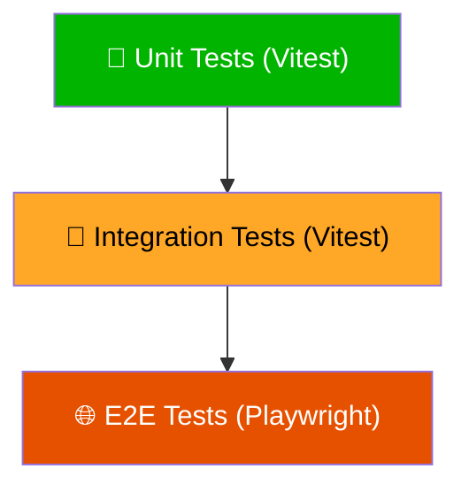
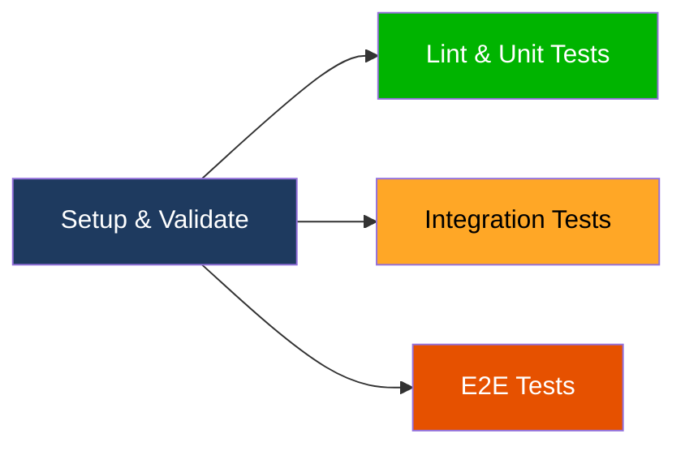

# 🧪 Testing

DragonBallDle follows a layered testing strategy with three levels: unit, integration, and end-to-end (E2E).

## Testing Pyramid



| Level | Tool | Scope | Speed |
|---|---|---|---|
| Unit | Vitest + Testing Library | Individual functions, hooks, components | ⚡ Fast |
| Integration | Vitest + Testing Library | Component interactions, context providers | 🔄 Medium |
| E2E | Playwright | Full user flows across pages | 🐢 Slow |

## Quick Reference

```bash
# Run all tests
pnpm test

# Run by level
pnpm test:unit
pnpm test:integration
pnpm test:e2e

# Interactive mode
pnpm test:watch        # Vitest watch mode
pnpm test:ui           # Vitest web UI
pnpm test:e2e:ui       # Playwright web UI
pnpm test:e2e:report   # Show last E2E report
```

## File Conventions

### Colocation

Tests live in `__tests__/` folders **as close as possible** to the code they test:

```text
src/features/game-engine/hooks/
├── useGameFlow.ts
├── useGuesses.ts
└── __tests__/
    ├── unit/
    │   └── useGameFlow.test.ts
    └── integration/
        └── useGuesses.test.tsx
```

### Naming

| Level | Pattern | Example |
|---|---|---|
| Unit | `**/__tests__/unit/*.test.{ts,tsx}` | `useGameFlow.test.ts` |
| Integration | `**/__tests__/integration/*.test.{ts,tsx}` | `useGuesses.test.tsx` |
| E2E | `tests/e2e/*.spec.ts` | `classic-flow.spec.ts` |

## Configuration

### Vitest (`vitest.config.ts`)

```typescript
export default defineConfig({
  plugins: [react()],
  test: {
    environment: "jsdom",
    globals: true,
    setupFiles: ["./vitest.setup.tsx"],
    include: ["src/**/*.test.{ts,tsx}", "src/**/*.spec.{ts,tsx}"],
  },
  resolve: {
    alias: {
      "@": resolve(__dirname, "./src"),
    },
  },
});
```

### Playwright (`playwright.config.ts`)

E2E tests run against a built Next.js application. Playwright configuration includes:
- Multiple browser projects (Chromium, Firefox, WebKit)
- Automatic dev server startup
- Screenshot and trace capture on failure

## Writing Tests

### Query Priority

Always prefer accessible queries over test IDs:

```typescript
// ✅ Preferred
screen.getByRole("button", { name: /start/i });
screen.getByText(/goku/i);
screen.getByLabelText(/search/i);

// ❌ Avoid
screen.getByTestId("start-button");
```

### Unit Test Example

```typescript
import { describe, it, expect } from "vitest";
import { compareValue, GuessStatus } from "../types/guess";

describe("compareValue", () => {
  it("returns CORRECT for exact match", () => {
    expect(compareValue("saiyan", "saiyan")).toBe(GuessStatus.CORRECT);
  });

  it("returns PARTIAL for overlapping values", () => {
    expect(compareValue("saiyan,human", "saiyan,namekian"))
      .toBe(GuessStatus.PARTIAL);
  });

  it("returns WRONG for no match", () => {
    expect(compareValue("human", "namekian")).toBe(GuessStatus.WRONG);
  });
});
```

### Integration Test Example

```typescript
import { render, screen } from "@testing-library/react";
import userEvent from "@testing-library/user-event";

describe("GuessInput", () => {
  it("adds a guess when user selects a character", async () => {
    const user = userEvent.setup();
    render(<GameWrapper><GuessInput /></GameWrapper>);

    await user.type(screen.getByRole("textbox"), "Goku");
    await user.click(screen.getByText("Son Goku"));

    expect(screen.getByText("Son Goku")).toBeInTheDocument();
  });
});
```

## CI Pipeline

Tests run automatically on every push to `main` and on pull requests via GitHub Actions (`.github/workflows/ci.yml`):



| Job | Steps | Runs on |
|---|---|---|
| **Setup & Validate** | Checkout, validate secrets, install deps | Every push/PR |
| **Lint & Unit** | `pnpm lint` + `pnpm test:unit` | After setup |
| **Integration** | `pnpm test:integration` | After setup (parallel) |
| **E2E** | Install Playwright browsers + `pnpm test:e2e` | After setup (parallel) |

> [!TIP]
> The CI caches Playwright browsers by version to speed up E2E runs. The cache key includes the exact Playwright version from `package.json`.

## Related Docs

- [Getting Started](./getting-started.md) — running tests locally
- [Contributing](./contributing.md) — test requirements for PRs
